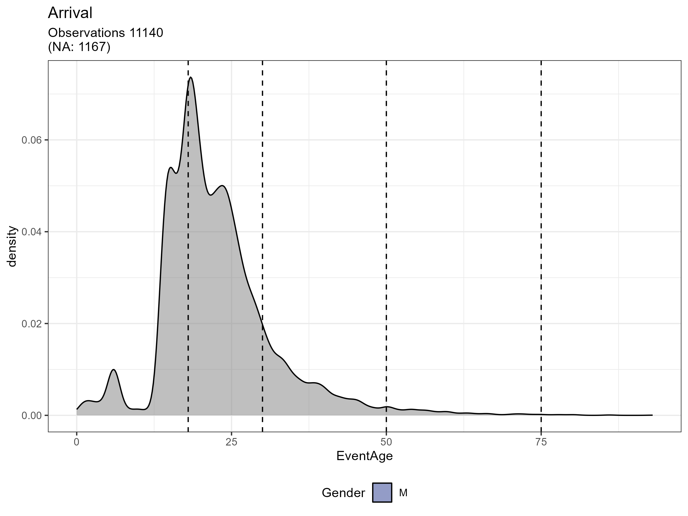
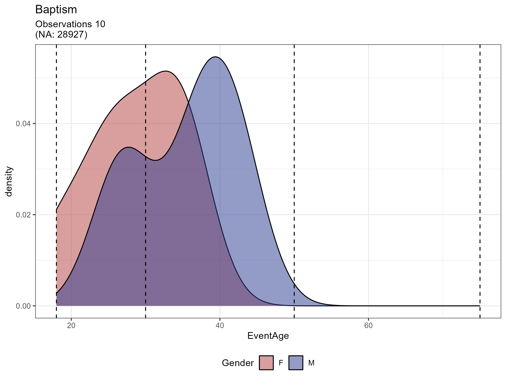
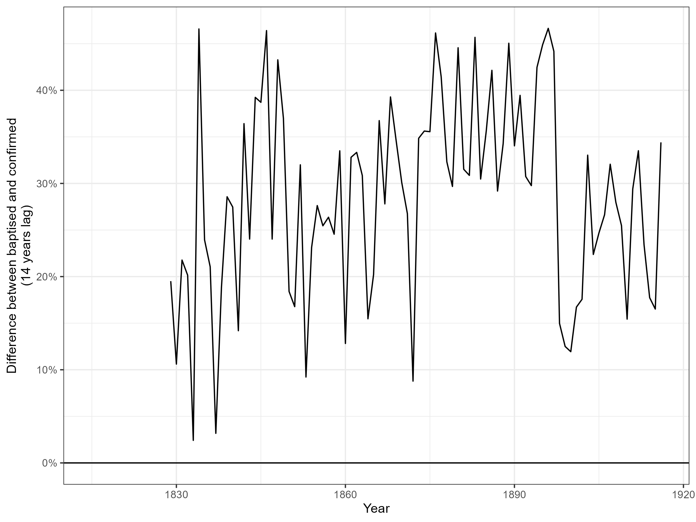

```{r setup, include=FALSE}
knitr::opts_chunk$set(eval=TRUE, include=TRUE, cache=TRUE, warnings = FALSE, message = FALSE, echo = FALSE)
library(tidyverse)
setwd("..") # Only when knitting
load("Data/Tmp_data/toydata.Rdata")
load("Data/Tmp_data/toydata_clean.Rdata")
```

```{r xaringan-panelset, echo=FALSE}
xaringanExtra::use_panelset()
```

```{r xaringan-tile-view, echo=FALSE}
xaringanExtra::use_tile_view()
```

```{r xaringan-logo, echo=FALSE}
xaringanExtra::use_logo(
  image_url = "Logos.png",
  width = "55px"
)
```

```{r xaringanExtra, echo = FALSE}
xaringanExtra::use_progress_bar(color = "#808080", location = "top")
```

```{css echo=FALSE}
.pull-left {
  float: left;
  width: 48%;
}
.pull-right {
  float: right;
  width: 48%;
}
.pull-right ~ p {
  clear: both;
}


.pull-left-wide {
  float: left;
  width: 66%;
}
.pull-right-wide {
  float: right;
  width: 66%;
}
.pull-right-wide ~ p {
  clear: both;
}

.pull-left-narrow {
  float: left;
  width: 30%;
}
.pull-right-narrow {
  float: right;
  width: 30%;
}

.small123 {
  font-size: 0.80em;
}

.large123 {
  font-size: 2em;
}

.huge123 {
  font-size: 4em;
}

.highlight {
  background-color: yellow;
}


img {
    transition:transform 0.25s ease;
}

img:hover {
    -webkit-transform:scale(1.5); /* or some other value */
    transform:scale(1.5);
}

```


# 'What to do with lots of data'

.pull-left[
## Introduction
- 22 mil. observations from church books
- Can we use it for something (yes).
- What can we use it for?

## Today
- Mostly descriptive statistics
- Based on 'toysample' of 100k observations 
- Some data problems but also opportunities 
]

.pull-right[

*Church book 1866 from Gråbrødre Hospitals Sogn*

]

---
# Context: What similar data do we have from Link Lives? 
- Census records (1787, 1801, 1834, 1840, 1845, 1850, 1860, 1880, 1885 (cph), 1901) 
  + With gender, place of birth, current parish, occupation, civil status, etc.
- Burial records for Copenhagen 1861-1911
- Some attempt at linking some of these 
- ...And we also have HISCO codes for all of this data  

- The church books adds more granular data and more of it. 

---
.pull-left[
### Basic data info
- Transcription done by *Ancestry*
- Years **1813-1917**
- Covers baptism, confirmation, marriages, burials, arrivals and departures 
- Made available to us via Link lives 

### Historical background (1/2)*
- Church books is a tradition dating back to the late 16th century
- **1645-46**: Church book kept by law
  + Religious and administrative purposes 
- **1736:** Confirmation added 
- **1812:** Standardisation and *arrival* and *departure* added 
]

.footnote[
.small123[\*Stenbæk (2023) https://denstoredanske.lex.dk/kirkeb%C3%B8ger]
]

--

.pull-right[
### Historical background (2/2)*
- **Two books kept:** Main book and 'counter' book (Ministerialbog og kontraministerial bog)
- Both kept to ensure data quality and that archives were not lost 
- Acted as central database of citisens 
- Still does to some extend 

.center[
```{r out.width="200px"}
knitr::include_graphics("https://upload.wikimedia.org/wikipedia/commons/thumb/1/11/Henning_Toft_Bro3_%28crop%29.jpg/381px-Henning_Toft_Bro3_%28crop%29.jpg?20120208065610")
```
  
.small123[*Danish priest - they've got your data! (wikimedia.org)*]
]

]

---
# Data comes in one big file
.pull-left-narrow[
- It follows some internal standard format at *Ancestry*
- *Wide* format
- Will cause us trouble
]

.pull-right-wide[
```{r}
data0 = data1
x = data0 %>% names() %>% data.frame(`Variable names` = .)

DT::datatable(
  x,
  fillContainer = FALSE, options = list(pageLength = 6),
  filter = "top"
)
```
]


---
# Data problems
- Sometimes a range of years is provided: "1862-1864"
- Sometimes the *county* is written in the *state* column
- ~1 week of work in geotagging 
- ~1 month of work if we want it done well 


---
# Basic stats

.pull-left[
- 22.8 mil observations
- Baptism, burial, etc. (see on the right)
- Additionally 5.5% unidentified observations
]


.pull-right[
.center[
### Distribution
]
```{r}
data_clean %>% 
  group_by(event) %>% 
  count() %>% 
  ungroup() %>% 
  mutate(
    pct = paste0(signif(100*n/sum(n), 4), "%")
  ) %>% 
  arrange(-n) %>% 
  select(-n) %>% 
  knitr::kable(format = "pipe")
```
]


---
.pull-left-narrow[
# Event ages
- Arrival and Departure alignes
- No age for confirmations
- A lot of missing values
- Good stats for arrival and departures
- Some of the missing values might be due to ranges "1856-1861" 
- We can estimate 97.2% of genders based on names ([See slide 11, 13](https://raw.githack.com/christianvedels/News_and_Market_Sentiment_Analytics/main/Lecture%204%20-%20Classification%20pt%202/Slides.html#16))
]

.pull-right-wide[
.small123[
.panelset[
.panel[.panel-name[All panes]

]
.panel[.panel-name[Arrival]

]
.panel[.panel-name[Baptism]

]
.panel[.panel-name[Burial]

]
.panel[.panel-name[Death]

]
.panel[.panel-name[Departure]

]
.panel[.panel-name[Marriage]

]

]
]
]

---
.pull-left-narrow[
# Years
- 0.4% EventYear NA 'by coercion'

]

.pull-right-wide[
.small123[
.panelset[
.panel[.panel-name[All]

]
.panel[.panel-name[Arrival]

]
.panel[.panel-name[Baptism]

]
.panel[.panel-name[Burial]

]
.panel[.panel-name[Death]

]
.panel[.panel-name[Departure]

]
.panel[.panel-name[Marriage]

]

]
]
]

---
# Crude child mortality
.pull-left[
- Confirmation at 14 
- Lag of Baptism and confirmation
]

.pull-right[

]


---
# Geography
.pull-left[
- 2982 parishes (spelling mistakes, changing borders etc.)
- Mix-up between 'county' and 'state' variables
- Some migration from abroad 
- Automatic geo coding failed
- Should we use better parish borders than 1820?

]


---
# Applicaitons

- Growth or reallocation: All sources of population growth are now available: Birth, Death, Arrival, Departure 
- Mobility 
- Linking to census data:
  + Marriages 
  + Occupations 
  + Individual fertility 
- A lot more 
- Requires thorough cleaning of data 


---
# References
Stenbæk, Jørgen (2023). Kirkebøger i Den Store Danske på lex.dk. https://denstoredanske.lex.dk/kirkeb%C3%B8ger


